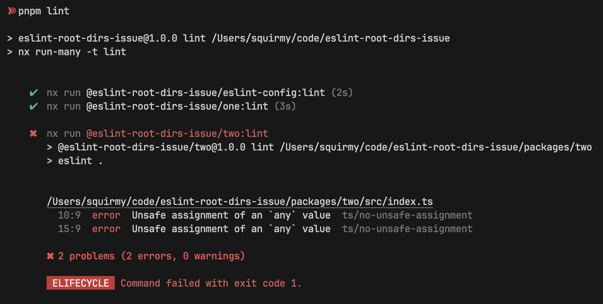

# eslint-root-dirs-issue

Example of types not being correctly picked up when they come from another separate root directory in a mono repo setup.

Expected: Project lints with no errors.
Actual:
```
       /Users/squirmy/code/eslint-root-dirs-issue/packages/two/src/index.ts
         10:9  error  Unsafe assignment of an `any` value  ts/no-unsafe-assignment
         15:9  error  Unsafe assignment of an `any` value  ts/no-unsafe-assignment

       ✖ 2 problems (2 errors, 0 warnings)
```

To reproduce:

1. `pnpm install`
2. `pnpm lint`


